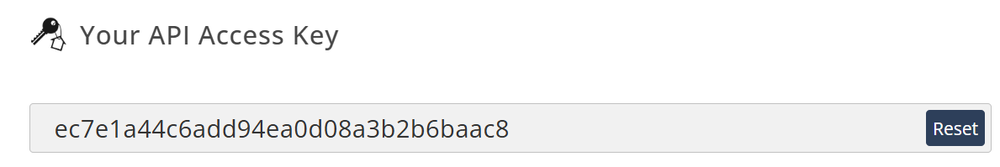

# CSC207 - _Aviation Project_
## Group #193

### Members:  
Anthony Stanimirov Bonev - anthonybonev  
Abigail Alexis Burke - Silly-String  
Linghan Andrew Mei - AwesomeAndrewMei  
Daniel Benjamin Rogojanski - Daniel-Rogo  
Niala Mikalya Samlalsingh - Niala1212  

## Project Purpose:
The domain for the project is air travel, and we will focus on real-time flight tracking by pulling data from a related
API. This proposed software will be able to search for flight, airline, and airport information and visualize flight
data on maps.

## Contents:
#### + _User Stories_
###### - _Main Features_
#### + _Installation Instructions_
###### - _Usage_
#### + _License_
#### + _Feedback & Contributors_

## User Stories:
Team Usecase: search by flight number

Search by airline - Abigail

Search airport arrivals - Niala

Search airport departures - Anthony

Search landed flights by airport - Andrew

Show world map - Daniel

***
### Main Features:

#### Team User story:
- As a flight operations manager, Sarah wants to search for flights by their flight number so that she can quickly
access detailed flight information, including status updates, departure and arrival times, and any changes, to stay on
top of her daily operations. She runs the program and searches by flight number to find her results.

#### Niala’s User Story:
- Niala, an airport operations supervisor, needs to search for the list of flights arriving at a specific airport so
that she can track incoming flights and ensure proper coordination for gate assignments and passenger flow. She runs the
program and inputs the airport iata code to see all incoming flights for the day.

#### Anthony’s User Story:
- Anthony, a ground operations coordinator, wants to search for the list of flights departing from a specific airport
so that he can monitor outgoing flights, ensure timely departures, and manage logistical operations such as baggage
handling. He runs the program and inputs the airport iata code to view the list of flights leaving the airport.

#### Abigail’s User Story:
- Sill wants to be able to search for flights by airline code so that they can view all flights operated by a specific
airline, making it easier for her to monitor the airline’s flight activity and handle customer queries more effectively.
They run the program and enter the airline iata code to pull up the list of flights for that airline.

#### Andrew’s User Story:
- Andrew, a data analyst at an airport, wants to search for flights that have already landed at a specific airport so
that he can analyze post-arrival data, such as on-time performance and passenger disembarkation times. He runs the
program and filters for landed flights to gather the required data.

#### Daniel’s User Story:
- Daniel, a flight tracking specialist, wants to view a world map that shows the current locations of flights in
real-time, helping him visually track flight movements and monitor global air traffic patterns throughout the day. He
runs the program and accesses the world map to track flights in real time across the globe.

## Installation Instructions:
1) Clone the repository.
2) In the scr folder in your local repository, right-click the 'java' package and mark it as 'sources root'.
3) Optionally:

Enter the test folder and mark that 'java' as 'test source root'. Then mark the 'SampleAPICalls' package,
in the same folder, as 'test resources root'.
4) Crate a free _aviationstack_ account using: https://aviationstack.com/

and copy your access key.
5) Navigate to the 'AllAPICalling.java' file in the folder: \src\java\dataaccess

and paste you code into the quotation
marks in this line:

_private static final String ACCESSKEY = "..."_

(eg: "ec7e1a44c6add94ea0d08a3b2b6baac8")

***
### Usage:
6) Open the 'Main.java' file in the folder: \src\java\app

and run the file to interact with the program.

## License:
This project is currently not licensed for public use.  
Please do not use, fork, or distribute this code at this time.  
The licensing terms will be updated in the future if anything changes.

## Feedback & Contributors:
We’re not accepting code contributions at this time, but we welcome:
- Suggestions for features or improvements (via issues)
- General feedback on the project

We’ll update this policy and the license when we’re ready for direct contributions.